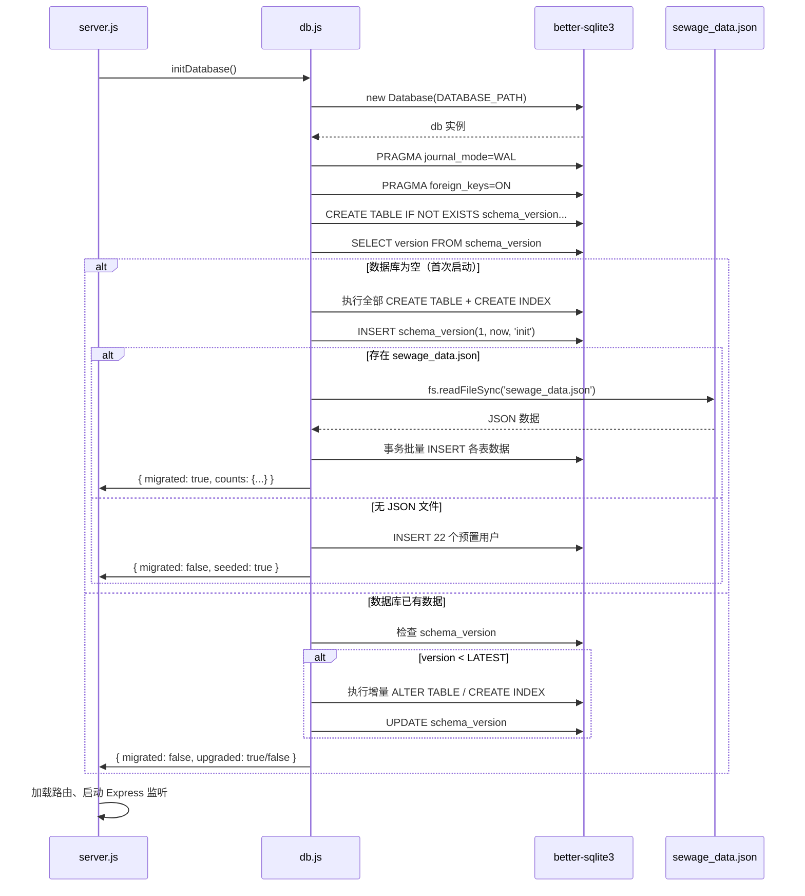
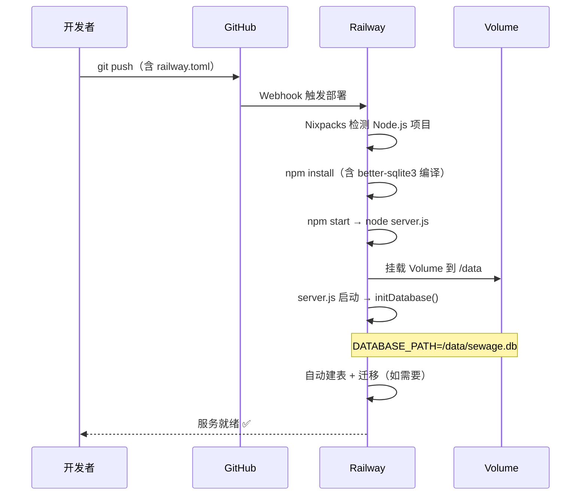
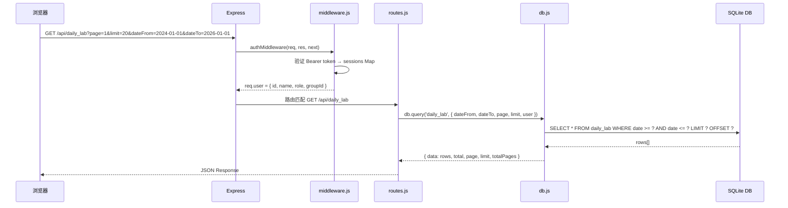
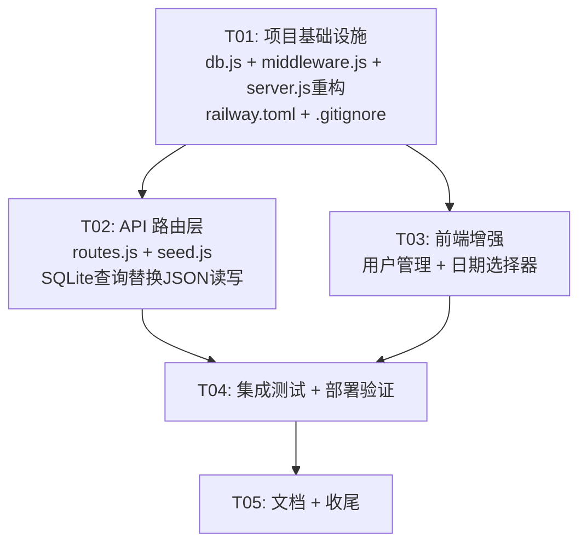

# 污水厂运行管理系统 — Railway 部署架构设计

> 架构师：高见远 | 版本：v1.0 | 日期：2026-05-30

---

## 1. 实现方案 + 框架选型

### 1.1 核心技术挑战

| 挑战 | 分析 | 方案 |
|------|------|------|
| **Railway 文件系统临时性** | JSON 文件在重启后丢失，所有业务数据将丢失 | 迁移到 better-sqlite3 + Railway Volume |
| **全量 JSON 读写性能** | 当前 `loadDB()`/`saveDB()` 每次请求都读写整个 JSON 文件（0.5MB+），随数据增长将急剧恶化 | SQLite 按行操作，原生索引，性能提升 10-100x |
| **Excel 导出 2 年数据** | 前端无日期选择器，后端已支持 dateFrom/dateTo 但前端没传 | 前端增加日期范围选择器 |
| **用户管理缺失** | 22 个预置用户硬编码在 `initDB()` 中，无管理界面 | 新增用户 CRUD API + 管理界面 |
| **单文件 server.js 过大** | 1490 行单文件，维护困难 | 拆分为模块化结构 |

### 1.2 框架与库选型

| 选型 | 决定 | 理由 |
|------|------|------|
| **数据库** | **better-sqlite3** | 零配置、单文件、同步 API 与现有代码风格一致、性能优异、WAL 模式支持并发读 |
| **为什么不用 PostgreSQL** | 本系统单实例部署、数据量小（<10MB）、无需复杂查询；SQLite + Volume 更轻量、零运维 |
| **Session 存储** | **保持内存 Map** | 用户数少（~22 人）、单实例部署；重启后重新登录即可，无需持久化 session |
| **数据迁移** | 启动时自动 JSON→SQLite | 检测到 JSON 文件且数据库为空时自动导入，一次迁移后可删除 JSON 文件 |
| **前端** | 保持原生 HTML + CSS + JS | 现有前端功能完整，避免引入构建工具增加复杂度 |

### 1.3 架构模式

- **后端**：Express MVC 变体 — 路由层(routes) + 中间件层(middleware) + 数据访问层(db)
- **数据层**：better-sqlite3 同步 API + WAL 模式
- **前端**：原生 SPA（单页应用），无构建步骤
- **部署**：Railway + Volume 持久化

### 1.4 Railway Volume 文件存储策略

```
Railway Volume 挂载点: /data
数据库文件路径: /data/sewage.db
环境变量: DATABASE_PATH=/data/sewage.db

启动时逻辑:
1. 如果 DATABASE_PATH 环境变量存在 → 使用该路径（Railway 生产环境）
2. 否则 → 使用 ./data/sewage.db（本地开发）
3. 如果数据库为空且存在 sewage_data.json → 自动迁移导入
```

---

## 2. 文件列表及相对路径

```
sewage-manager/
├── package.json                  # 修改：新增 better-sqlite3 依赖
├── server.js                     # 修改：精简为入口 + 启动逻辑
├── db.js                         # 新增：SQLite 数据库初始化 + 迁移 + 通用查询
├── middleware.js                  # 新增：认证中间件 + 角色权限定义
├── routes.js                     # 新增：所有 API 路由（从 server.js 提取）
├── seed.js                       # 新增：演示数据生成（从 server.js 提取）
├── railway.toml                  # 新增：Railway 部署配置
├── .gitignore                    # 新增：忽略 node_modules, data/, *.db
├── docs/
│   ├── system_design.md          # 本文档
│   ├── sequence-diagram.mermaid  # 调用流程图
│   └── class-diagram.mermaid     # 类图
├── public/
│   ├── index.html                # 修改：新增用户管理 tab + 导出日期选择器
│   ├── login.html                # 不变
│   ├── style.css                 # 修改：新增用户管理 + 日期选择器样式
│   └── app.js                    # 不变（旧版前端，已不使用）
└── sewage_data.json              # 迁移后可删除
```

**文件变更统计**：修改 4 个，新增 6 个，不变 2 个，可删除 1 个

---

## 3. 数据结构和接口

### 3.1 SQLite 表结构设计

从现有 JSON 结构映射，每个 JSON 数组对应一张表。所有表使用 `id TEXT PRIMARY KEY`（保持与现有数据兼容）。

```mermaid
erDiagram
    users {
        TEXT id PK
        TEXT username UK
        TEXT password
        TEXT name
        TEXT role
        TEXT phone
        TEXT groupId
        TEXT status
        TEXT createTime
    }
    
    do_inspection {
        TEXT id PK
        TEXT date
        TEXT shift
        TEXT series
        TEXT operator
        REAL anaerobic
        REAL anoxic
        REAL aerobic1
        REAL aerobic2
        REAL aerobic3
        REAL aerobic4
        TEXT remark
        TEXT groupId
        TEXT createTime
        TEXT updateTime
        TEXT updatedBy
    }
    
    hourly_water {
        TEXT id PK
        TEXT date
        INTEGER hour
        TEXT operator
        REAL inCod
        REAL inNh3
        REAL inTn
        REAL inTp
        REAL inFlow
        REAL inPh
        REAL outCod
        REAL outNh3
        REAL outTn
        REAL outTp
        REAL outFlow
        REAL outPh
        TEXT groupId
        TEXT createTime
        TEXT updateTime
        TEXT updatedBy
    }
    
    daily_lab {
        TEXT id PK
        TEXT date
        TEXT operator
        TEXT reviewer
        TEXT reviewStatus
        REAL ph
        REAL ss
        REAL bod5
        REAL cod
        REAL nh3
        REAL tn
        REAL tp
        REAL fecalColiform
        REAL sv30
        REAL svi
        REAL mlss
        TEXT microscope
        REAL sv30East
        REAL sv30West
        REAL waterTempEast
        REAL waterTempWest
        REAL internalReflux
        REAL externalReflux
        TEXT groupId
        TEXT createTime
        TEXT updateTime
        TEXT updatedBy
    }
    
    weekly_lab {
        TEXT id PK
        TEXT weekStart
        TEXT weekEnd
        TEXT operator
        REAL chloride
        REAL mlvss
        REAL totalSolid
        REAL dissolvedSolid
        TEXT createTime
        TEXT updateTime
        TEXT updatedBy
    }
    
    sludge_special {
        TEXT id PK
        TEXT date
        TEXT batchNo
        TEXT operator
        REAL waterContent
        REAL ph
        REAL organicMatter
        TEXT createTime
        TEXT updateTime
        TEXT updatedBy
    }
    
    dewatering {
        TEXT id PK
        TEXT date
        TEXT operator
        TEXT startTime
        TEXT endTime
        REAL duration
        REAL sludgeOutput
        TEXT abnormality
        TEXT groupId
        TEXT createTime
        TEXT updateTime
        TEXT updatedBy
    }
    
    chemical_dosing {
        TEXT id PK
        TEXT date
        TEXT shift
        TEXT operator
        REAL carbonSource
        REAL glucose
        REAL pac
        REAL anionPam
        REAL cationPam
        REAL naclo
        TEXT groupId
        TEXT createTime
        TEXT updateTime
        TEXT updatedBy
    }
    
    chemical_inventory {
        TEXT id PK
        TEXT date
        TEXT operator
        TEXT chemicalType
        TEXT type
        REAL quantity
        REAL balance
        TEXT supplier
        TEXT batchNo
        TEXT remark
        TEXT createTime
    }
    
    alerts {
        TEXT id PK
        TEXT time
        TEXT type
        TEXT level
        TEXT source
        TEXT title
        TEXT detail
        TEXT status
        TEXT resolvedBy
        TEXT resolvedTime
    }
    
    tasks {
        TEXT id PK
        TEXT title
        TEXT type
        TEXT priority
        TEXT status
        TEXT assignedTo
        TEXT deadline
        TEXT remark
        TEXT createTime
    }
    
    exportLog {
        TEXT id PK
        TEXT table
        INTEGER count
        TEXT operator
        TEXT time
    }
    
    schema_version {
        INTEGER version PK
        TEXT appliedAt
        TEXT description
    }
```



#### 索引设计

```sql
-- 高频查询：按日期筛选（几乎所有表都有 date 字段）
CREATE INDEX idx_do_inspection_date ON do_inspection(date);
CREATE INDEX idx_hourly_water_date ON hourly_water(date);
CREATE INDEX idx_daily_lab_date ON daily_lab(date);
CREATE INDEX idx_dewatering_date ON dewatering(date);
CREATE INDEX idx_chemical_dosing_date ON chemical_dosing(date);
CREATE INDEX idx_chemical_inventory_date ON chemical_inventory(date);
CREATE INDEX idx_sludge_special_date ON sludge_special(date);

-- 高频查询：用户登录
CREATE UNIQUE INDEX idx_users_username ON users(username);

-- 高频查询：预警活跃状态
CREATE INDEX idx_alerts_status ON alerts(status);

-- 高频查询：任务状态
CREATE INDEX idx_tasks_status ON tasks(status);

-- 高频查询：库存按药剂类型
CREATE INDEX idx_inventory_type ON chemical_inventory(chemicalType);

-- 高频查询：运营班组按组过滤
CREATE INDEX idx_do_inspection_group ON do_inspection(groupId);
CREATE INDEX idx_hourly_water_group ON hourly_water(groupId);
CREATE INDEX idx_dewatering_group ON dewatering(groupId);
CREATE INDEX idx_chemical_dosing_group ON chemical_dosing(groupId);
```

### 3.2 新增用户管理 API 接口

当前 `users` 表已有通用 CRUD 路由（`GET/POST/PUT/DELETE /api/users`），但缺少以下关键接口：

| 方法 | 路径 | 权限 | 说明 |
|------|------|------|------|
| `POST` | `/api/users/:id/reset-password` | `canManage` | 管理员重置用户密码 |
| `PUT` | `/api/users/:id/password` | 本人 或 canManage | 修改密码（需验证旧密码） |
| `GET` | `/api/users/roles` | 已登录 | 获取角色列表和权限定义 |
| `GET` | `/api/users/groups` | 已登录 | 获取班组列表 |

**请求/响应格式**：

```javascript
// POST /api/users/:id/reset-password
// Request: { newPassword: "xxx" }
// Response: { success: true }

// PUT /api/users/:id/password
// Request: { oldPassword: "xxx", newPassword: "xxx" }  // 管理员无需 oldPassword
// Response: { success: true }

// GET /api/users/roles
// Response: { roles: { "厂长": { canViewAll: true, ... }, ... } }

// GET /api/users/groups
// Response: { groups: ["group1", "group2", "group3", "group4"] }
```

### 3.3 导出接口增强（已有，需前端配合）

后端 `/api/export/:table` 已支持 `dateFrom` 和 `dateTo` 查询参数，无需修改。前端需添加日期选择器。

---

## 4. 程序调用流程

### 4.1 启动时自动建表 + 迁移流程



### 4.2 Railway 部署流程



### 4.3 日常请求处理流程



---

## 5. 任务列表（有序、含依赖关系、按实现顺序排列）

### T01: 项目基础设施（数据库迁移 + 部署配置 + 入口重构）

**源文件**：`package.json`, `server.js`, `db.js`, `middleware.js`, `railway.toml`, `.gitignore`

**内容**：
- `package.json`：新增 `better-sqlite3` 依赖，添加 `engines.node`
- `db.js`：SQLite 数据库初始化、建表、索引、JSON→SQLite 自动迁移、通用查询/写入方法
- `middleware.js`：从 server.js 提取 ROLES 定义、authMiddleware、requireRole、CHINESE_FIELDS、getAccessibleTables
- `server.js`：精简为 Express 入口 + 启动逻辑，引入 db.js 和 middleware.js
- `railway.toml`：Railway 部署配置（builder、start command、Volume 挂载声明）
- `.gitignore`：忽略 node_modules、data/、*.db、sewage_data.json（迁移后）

**依赖**：无
**优先级**：P0

---

### T02: API 路由层（CRUD + 业务逻辑 + 用户管理 + 导出增强）

**源文件**：`routes.js`, `seed.js`

**内容**：
- `routes.js`：从 server.js 提取所有 API 路由，改用 db.js 的 SQLite 查询替代 loadDB()/saveDB()
  - 认证路由（login/logout/me）
  - 通用 CRUD 路由（GET/POST/PUT/DELETE + bulk）
  - 预警引擎路由（alerts/active, alerts/:id/resolve）
  - 业务分析路由（dosing/analysis, sludge/analysis, trends, inventory 等）
  - Excel 导出路由（export/:table，已有 dateFrom/dateTo 支持）
  - **新增**：用户管理路由（reset-password, change-password, roles, groups）
- `seed.js`：从 server.js 提取演示数据生成逻辑，改用 SQLite 批量 INSERT

**依赖**：T01
**优先级**：P0

---

### T03: 前端增强（用户管理界面 + 导出日期选择器 + 样式）

**源文件**：`public/index.html`, `public/style.css`

**内容**：
- `public/index.html`：
  - 新增「用户管理」入口（仅 canManage 角色可见）
  - 用户管理页面：用户列表、新增用户、编辑用户、重置密码对话框
  - 数据导出增加日期范围选择器（dateFrom/dateTo input[type=date]），默认范围 2 年
  - 导出按钮点击时携带 dateFrom/dateTo 参数
- `public/style.css`：
  - 用户管理页面样式（表格、表单、对话框）
  - 日期选择器样式
  - 响应式适配

**依赖**：T01（需要新的 API 端点就绪）
**优先级**：P1

---

### T04: 端到端集成测试 + Railway 部署验证

**源文件**：`server.js`, `db.js`, `routes.js`, `railway.toml`

**内容**：
- 本地启动验证：`npm start` 确认 SQLite 自动建表、JSON 迁移正常
- API 回归测试：验证所有 22+ API 端点功能正常
  - 登录认证
  - CRUD 操作（含权限隔离）
  - Excel 导出（含 2 年日期范围）
  - 智能加药分析
  - 预警引擎
- Railway 部署测试：
  - `railway up` 或 GitHub 集成部署
  - 验证 Volume 挂载和数据持久化（重启后数据不丢失）
  - 验证公网访问
- 修复集成问题

**依赖**：T01, T02, T03
**优先级**：P0

---

### T05: 文档 + 收尾（环境变量模板 + 部署指南 + 清理）

**源文件**：`package.json`, `.gitignore`, `docs/`

**内容**：
- 创建 `RAILWAY_DEPLOY.md` 部署指南（包含 Railway 创建项目、添加 Volume、配置环境变量步骤）
- 创建 `.env.example` 本地开发环境变量模板
- 确认 `sewage_data.json` 迁移后可安全删除（在 .gitignore 中标记）
- 清理 server.js 中残留的旧 loadDB/saveDB 引用
- 最终代码审查和优化

**依赖**：T04
**优先级**：P2

---

### 任务依赖图



---

## 6. 依赖包列表

```
- express@^4.22.2: Web 框架（已有）
- cors@^2.8.6: 跨域支持（已有）
- exceljs@^4.4.0: Excel 导出（已有）
- better-sqlite3@^11.7.0: SQLite3 同步驱动（新增 — 持久化数据库）
```

**不需要新增的包**：
- 不需要 `sqlite3`（异步版本），better-sqlite3 同步 API 更简单
- 不需要 ORM（Sequelize/Prisma），表结构简单，直接 SQL 更高效
- 不需要 session 持久化库（connect-redis 等），内存 Map 足够
- 不需要前端构建工具，保持原生 HTML/CSS/JS

---

## 7. 共享知识（跨文件约定）

### 7.1 数据库访问约定

```javascript
// ✅ 正确：使用 db.js 导出的方法
const { getDB, query, run, insert } = require('./db');

// GET 请求 — 使用参数化查询
const rows = query('SELECT * FROM daily_lab WHERE date >= ? AND date <= ?', [dateFrom, dateTo]);

// INSERT — 使用 insert 辅助方法
insert('daily_lab', { id, date, operator, ... });

// ❌ 禁止：直接 loadDB()/saveDB() — 已废弃
```

### 7.2 API 响应格式

```javascript
// 列表接口统一返回分页格式
{ data: [...], total: 100, page: 1, limit: 20, totalPages: 5 }

// 单条操作成功
{ success: true, id: "xxx" }

// 错误响应
{ error: "错误描述" }  // 配合 HTTP 状态码 400/401/403/404/500
```

### 7.3 认证约定

```javascript
// Token 格式：Bearer <token>
// Token 存储：req.headers.authorization
// Session 存储：内存 Map（sessions），24 小时过期
// Token 生成：crypto.randomUUID()
```

### 7.4 日期约定

```javascript
// 所有日期存储为 TEXT 格式 'YYYY-MM-DD'（ISO 8601 日期部分）
// 时间戳存储为 TEXT 格式 ISO 8601 UTC（如 '2026-05-30T11:07:42.088Z'）
// 前端日期选择器使用 <input type="date">
```

### 7.5 ID 生成约定

```javascript
// 保持与现有数据兼容的 ID 格式
// 用户: 'u1', 'u2', ... 'u22'
// 数据记录: '{table}_{timestamp}_{random}'  如 'daily_lab_1717000000000_a1b2c'
// 预警: 'alt_{timestamp}_{type}'
```

### 7.6 环境变量

```bash
# Railway 生产环境（必填）
DATABASE_PATH=/data/sewage.db    # Railway Volume 挂载路径
PORT=3000                         # Railway 自动注入

# 本地开发（可选）
DATABASE_PATH=./data/sewage.db    # 本地数据库路径（默认值）
```

### 7.7 db.js 核心方法签名

```javascript
module.exports = {
  getDB,            // () => Database  — 获取数据库实例
  initDatabase,     // () => { migrated, counts } — 初始化建表+迁移
  query,            // (sql, params?) => row[] — 查询返回行数组
  queryOne,         // (sql, params?) => row|undefined — 查询返回单行
  run,              // (sql, params?) => { changes, lastInsertRowid } — 执行写操作
  insert,           // (table, obj) => { changes, lastInsertRowid } — 插入对象
  update,           // (table, obj, whereClause, whereParams) => { changes } — 更新
  count,            // (table, where?, params?) => number — 计数
  paginate,         // (table, options) => { data, total, page, limit, totalPages } — 分页查询
  transaction,      // (fn) => result — 事务包装
};
```

---

## 8. 待明确事项

| # | 事项 | 当前假设 | 建议 |
|---|------|---------|------|
| 1 | **密码安全** | 当前明文存储密码 | 建议 T01 使用 `crypto.scryptSync` 加盐哈希，但需兼容现有明文密码登录（迁移时自动升级） |
| 2 | **HTTPS** | Railway 默认提供 HTTPS | 无需额外配置 |
| 3 | **数据库备份** | Railway Volume 无自动备份 | 建议后续添加定时 `sqlite3 .dump` 备份到外部存储（S3/OSS），本次不实现 |
| 4 | **并发写入** | 单实例 WAL 模式足够 | 如未来需要多实例，需切换到 PostgreSQL |
| 5 | **前端 app.js** | 存在 `public/app.js` 与 `index.html` 内联脚本功能重叠 | 保留 `index.html` 内联版为主版本，`app.js` 为旧版（已不使用） |
| 6 | **Volume 大小** | Railway Volume 最小 1GB | 对于 SQLite 数据库（预计 <50MB），1GB 足够 |
| 7 | **每日化验表重复** | `sewage_data.json` 中 `daily_lab` 出现在 getEmptyDB() 的 keys 和 ALL_TABLES 中 | SQLite 建表只建一次，数据不重复 |

---

## 附录：db.js 关键实现伪代码

```javascript
const Database = require('better-sqlite3');
const path = require('path');
const fs = require('fs');

const DB_PATH = process.env.DATABASE_PATH || path.join(__dirname, 'data', 'sewage.db');

// 确保目录存在
const dir = path.dirname(DB_PATH);
if (!fs.existsSync(dir)) fs.mkdirSync(dir, { recursive: true });

let _db = null;

function getDB() {
  if (!_db) {
    _db = new Database(DB_PATH);
    _db.pragma('journal_mode = WAL');
    _db.pragma('foreign_keys = ON');
    _db.pragma('busy_timeout = 5000');
  }
  return _db;
}

function initDatabase() {
  const db = getDB();
  const result = { migrated: false, counts: {} };
  
  // 检查是否已初始化
  const tables = db.prepare("SELECT name FROM sqlite_master WHERE type='table' AND name='users'").all();
  
  if (tables.length === 0) {
    // 首次启动：建表
    db.exec(SCHEMA_SQL);
    db.exec(INDEX_SQL);
    
    // 检查是否有 JSON 数据可迁移
    const jsonPath = path.join(__dirname, 'sewage_data.json');
    if (fs.existsSync(jsonPath)) {
      const jsonData = JSON.parse(fs.readFileSync(jsonPath, 'utf8'));
      migrateFromJSON(db, jsonData, result);
      result.migrated = true;
    } else {
      // 初始化默认用户
      seedDefaultUsers(db);
    }
  }
  
  return result;
}

function query(sql, params = []) {
  return getDB().prepare(sql).all(...params);
}

function queryOne(sql, params = []) {
  return getDB().prepare(sql).get(...params);
}

function run(sql, params = []) {
  return getDB().prepare(sql).run(...params);
}

function insert(table, obj) {
  const keys = Object.keys(obj);
  const placeholders = keys.map(() => '?').join(',');
  const sql = `INSERT INTO ${table} (${keys.join(',')}) VALUES (${placeholders})`;
  return getDB().prepare(sql).run(...keys.map(k => obj[k]));
}

function paginate(table, { where = '', params = [], page = 1, limit = 100, orderBy = 'date DESC' } = {}) {
  const whereClause = where ? ` WHERE ${where}` : '';
  const total = queryOne(`SELECT COUNT(*) as cnt FROM ${table}${whereClause}`, params).cnt;
  const data = query(`SELECT * FROM ${table}${whereClause} ORDER BY ${orderBy} LIMIT ? OFFSET ?`, [...params, limit, (page - 1) * limit]);
  return { data, total, page, limit, totalPages: Math.ceil(total / limit) };
}

function transaction(fn) {
  return getDB().transaction(fn)();
}

function migrateFromJSON(db, jsonData, result) {
  const TABLES = ['users', 'do_inspection', 'hourly_water', 'daily_lab', 'weekly_lab', 
                   'sludge_special', 'dewatering', 'chemical_dosing', 'chemical_inventory', 
                   'alerts', 'tasks', 'exportLog'];
  
  db.transaction(() => {
    TABLES.forEach(table => {
      const rows = jsonData[table] || [];
      if (rows.length === 0) return;
      const insertMany = db.transaction((rows) => {
        for (const row of rows) {
          const keys = Object.keys(row);
          const placeholders = keys.map(() => '?').join(',');
          const sql = `INSERT OR IGNORE INTO ${table} (${keys.join(',')}) VALUES (${placeholders})`;
          db.prepare(sql).run(...keys.map(k => row[k]));
        }
      });
      insertMany(rows);
      result.counts[table] = rows.length;
    });
  })();
}

module.exports = { getDB, initDatabase, query, queryOne, run, insert, paginate, transaction };
```
